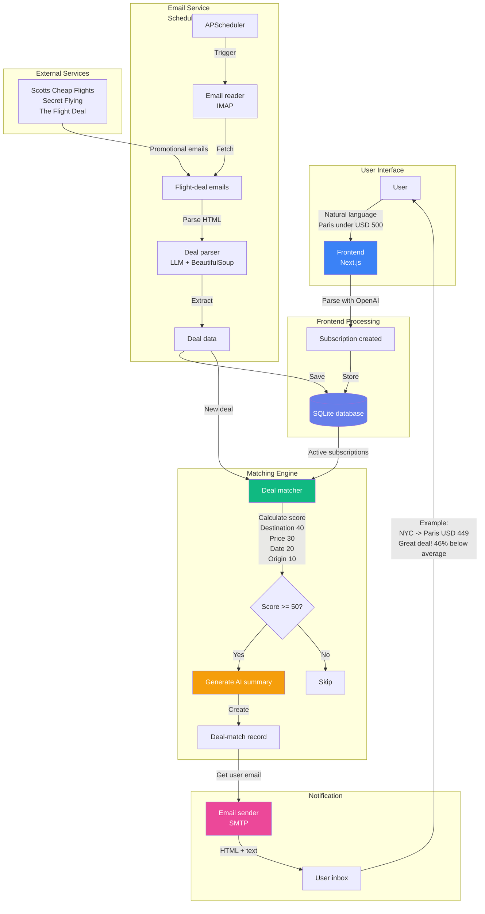

# SkyPulse - Intelligent Flight Deal System

**AI-Powered Flight Deal Discovery & Notification Platform**

SkyPulse is an intelligent flight deal recommendation system that combines natural language processing, automated deal monitoring, and personalized notifications to help users discover the best flight deals tailored to their preferences.

---

## 🌟 Overview

Instead of spending hours searching for flight deals, simply tell SkyPulse what you're looking for in natural language (e.g., "Weekend trip to Paris under $500 next month"), and the system will:

- **Monitor** flight deals continuously
- **Analyze** deals for value using AI
- **Notify** you via email with personalized recommendations
- **Explain** why each deal is good for your specific needs

---

## 🏗️ Architecture

SkyPulse consists of two main components:

### 1. **Frontend Application** (`/skypulse`)
- **Framework**: Next.js 14 (App Router)
- **Language**: TypeScript
- **Database**: SQLite with Prisma ORM
- **AI Integration**: OpenAI API for natural language processing
- **UI**: Modern, premium interface with Tailwind CSS & Framer Motion

**Key Features:**
- Natural language subscription creation
- Deal dashboard with intelligent recommendations
- Real-time AI-powered deal analysis
- Clean, responsive user interface

### 2. **Email Service** (`/skypulse-email`)
- **Language**: Python
- **Purpose**: Automated email notifications and deal matching
- **Components**:
  - Email parsing and processing
  - Deal matching engine
  - LLM-powered deal analysis
  - Notification delivery system

---

## � System Workflow



**Workflow Steps:**

1. **User Creates Subscription** - User enters travel preferences in natural language via web interface
2. **AI Parsing** - Frontend uses OpenAI to extract structured data (destination, price, dates)
3. **Storage** - Subscription saved to shared SQLite database
4. **Scheduled Monitoring** - Email service runs every 30 minutes (configurable)
5. **Email Fetching** - IMAP reader retrieves promotional emails from flight deal sources
6. **Deal Extraction** - Parser uses LLM to extract flight details from HTML emails
7. **Intelligent Matching** - Matching engine scores deals against subscriptions (0-100 points)
8. **AI Summary Generation** - For matches ≥50 points, LLM generates personalized explanation
9. **Notification Delivery** - SMTP sender emails user with deal details and AI insights

---

## �🚀 Getting Started

### Prerequisites

- **Node.js** 18+ (for frontend)
- **Python** 3.8+ (for email service)
- **OpenAI API Key**

### Installation

#### 1. Frontend Setup (`/skypulse`)

```bash
# Navigate to frontend directory
cd skypulse

# Install dependencies
npm install

# Create environment file
cp .env.example .env
# Edit .env and add your OpenAI API key:
# DATABASE_URL="file:./dev.db"
# OPENAI_API_KEY="sk-..."

# Initialize database
npx prisma migrate dev --name init

# Run development server
npm run dev
```

Open [http://localhost:3000](http://localhost:3000) in your browser.

#### 2. Email Service Setup (`/skypulse-email`)

```bash
# Navigate to email service directory
cd skypulse-email

# Create virtual environment
python -m venv venv

# Activate virtual environment
# Windows:
venv\Scripts\activate
# macOS/Linux:
source venv/bin/activate

# Install dependencies
pip install -r requirements.txt

# Configure environment
cp .env.example .env
# Edit .env with your configuration

# Run the service
python main.py
```

### Quick Start Usage

Once both services are running:

1. **Open the web interface**: http://localhost:3000
2. **Create a subscription** using natural language:
   ```
   "Weekend trip to Paris under $500 next month"
   "Business class to Tokyo in April under $2000"
   "Family vacation to Barcelona in summer"
   ```
3. **The system will**:
   - Parse your request with AI
   - Monitor flight deal emails automatically
   - Match deals to your preferences
   - Send you email notifications with personalized insights

**Example Notification Email:**
```
✈️ Deal Alert: NYC → Paris - $449

Route: NYC → Paris
Price: $449 USD
Airline: Air France
Dates: 2026-04-15 - 2026-04-22

🤖 AI Insight:
This is an excellent deal! The price is 46% below the average 
for this route during this season. Perfect timing for your 
April travel plans.

[Book Now →]
```

---

## 📂 Project Structure

```
cheap-flight/
├── skypulse/                    # Next.js Frontend Application
│   ├── app/                     # Next.js App Router pages & API routes
│   ├── components/              # Reusable UI components
│   ├── lib/                     # Shared utilities (DB client, LLM wrapper)
│   ├── prisma/                  # Database schema and migrations
│   ├── public/                  # Static assets
│   └── package.json
│
├── skypulse-email/              # Python Email Service
│   ├── email_service/           # Email processing modules
│   ├── llm/                     # LLM integration for deal analysis
│   ├── matching/                # Deal matching algorithms
│   ├── models/                  # Data models
│   ├── parsers/                 # Email parsing utilities
│   ├── config.py                # Configuration management
│   └── requirements.txt
│
└── README.md                    # This file
```

---

## 🛠️ Tech Stack

### Frontend
- **Framework**: Next.js 14 with App Router
- **Language**: TypeScript
- **Database**: SQLite + Prisma ORM
- **Styling**: Tailwind CSS
- **Animations**: Framer Motion
- **AI**: OpenAI API (GPT models)

### Backend (Email Service)
- **Language**: Python 3.8+
- **Email Processing**: Custom parsers
- **AI/LLM**: OpenAI integration
- **Data Models**: Pydantic

---

## ✨ Key Features

### 🗣️ Natural Language Subscriptions
No complex forms—just describe your travel plans naturally:
- "Weekend getaway to Barcelona under €300"
- "Business trip to New York next month"
- "Family vacation to Tokyo in summer"

### 🤖 AI-Powered Analysis
Uses OpenAI's LLM to:
- Understand user preferences and context
- Analyze flight deals for value
- Generate personalized explanations
- Match deals to user subscriptions

### 📧 Smart Notifications
Automated email notifications with:
- Personalized deal recommendations
- AI-generated insights on why deals are valuable
- Clear pricing and booking information
- Multi-channel support (planned: WhatsApp, Telegram)

### 📊 Deal Dashboard
Clean, premium interface featuring:
- Active subscription management
- Recommended flight deals
- Deal history and analytics
- Responsive design for all devices

---

## 🔧 Configuration

### Frontend Environment Variables

```env
# Database
DATABASE_URL="file:./dev.db"

# OpenAI API
OPENAI_API_KEY="sk-..."
```

### Email Service Environment Variables

See `skypulse-email/.env.example` for detailed configuration options including:
- Email service credentials
- LLM API keys
- Matching algorithm parameters
- Notification settings

---

## 🚦 Development Workflow

### Frontend Development

```bash
cd skypulse
npm run dev          # Start development server
npm run build        # Build for production
npm run start        # Start production server
npm run lint         # Run ESLint
```

### Database Management

```bash
npx prisma studio              # Open Prisma Studio (DB GUI)
npx prisma migrate dev         # Create and apply migrations
npx prisma generate            # Generate Prisma Client
```

---

## 📈 Roadmap

### ✅ Phase 1: Core System (Completed)
- [x] Natural language subscription creation
- [x] AI-powered deal analysis and parsing
- [x] Email notification system with HTML templates
- [x] Deal dashboard UI with responsive design
- [x] Email service backend (IMAP/SMTP)
- [x] Intelligent matching engine with scoring algorithm
- [x] Database integration (SQLite + Prisma + SQLAlchemy)
- [x] Scheduled email processing (APScheduler)

### 🚧 Phase 2: Enhancement & Testing (In Progress)
- [ ] End-to-end integration testing
- [ ] LLM provider configuration (Ollama/OpenAI/Groq)
- [ ] Production email credentials setup
- [ ] Performance optimization
- [ ] Error handling and retry logic

### 🔮 Phase 3: Advanced Features (Planned)
- [ ] Multi-channel notifications (WhatsApp, Telegram)
- [ ] Advanced filtering and preferences
- [ ] Price tracking and historical analysis
- [ ] User authentication and profiles
- [ ] Deal sharing and social features
- [ ] Mobile app (React Native)
- [ ] PostgreSQL migration for production
- [ ] Monitoring and analytics dashboard

### 📚 Phase 4: Documentation & Deployment (Partially Complete)
- [x] Update README with setup instructions
- [x] Add system workflow diagram
- [x] Add usage examples
- [x] Create comprehensive walkthrough
- [ ] Create deployment guide
- [ ] Add troubleshooting section
- [ ] Document LLM provider setup options
- [ ] Production deployment checklist

---

## 🤝 Contributing

This is a personal project, but contributions are welcome! Feel free to:
- Fork the repository
- Create feature branches
- Submit pull requests
- Report issues

---

## 📄 License

This project is licensed under the MIT License.

---

## 📧 Contact

For questions or feedback about this project, please reach out via:
- **GitHub Issues**: [Create an issue](https://github.com/MeghanBao/skypulse/issues)
- **Email**: menghanbao1@gmail.com

---

*Built with ❤️ using Next.js, TypeScript, Python, and AI*

*Last updated: February 9, 2026 - Phase 1 Complete*

